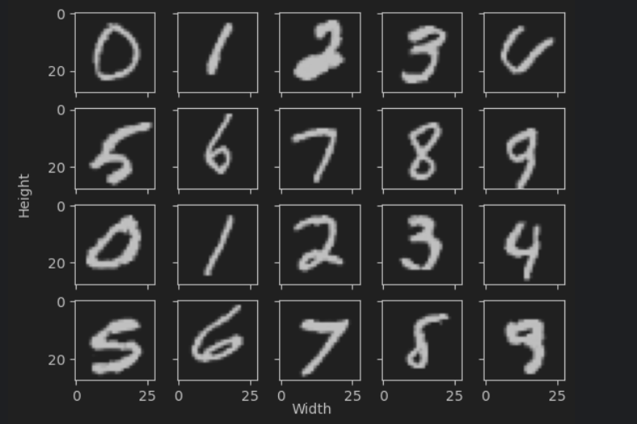

# PixelCNN Image Generation Project

## Overview

This project implements a PixelCNN model for image generation, trained on the MNIST dataset. The model leverages masked convolutions to ensure the autoregressive property, generating images pixel by pixel.

## Project Structure

### Main Script (`main.py`)

The main script handles the training loop and argument parsing.

#### Key Functions:

- **`train_loop`**: Handles the training and validation process for the model.
- **`discretize`**: Converts a sample to a long tensor by scaling pixel values.

#### Arguments:

- `--epochs`: Number of epochs for training (default: 50).
- `--lr`: Learning rate (default: 1e-3).
- `--gamma`: Learning rate decay factor for the scheduler (default: 0.99).
- `--in_channels`: Number of input channels (default: 1).
- `--inner_dim`: Inner dimension of the model (default: 64).
- `--batch_size`: Batch size for training (default: 128).

### Model Script (`model.py`)

Defines the PixelCNN model with gated masked convolutions.

#### Key Classes:

- **`MaskedConv2dPartial`**: Implements masked convolutions for PixelCNN.
- **`GatedMaskedConv`**: Implements a gated convolution block.
- **`PixelCNN`**: Main PixelCNN model class.

#### Methods:

- **`forward`**: Forward pass for the model.
- **`sample`**: Sampling function for image generation.

### Utils Script (`utils.py`)

Contains utility functions, including a function for displaying images.

## Training and Validation

### Data Preparation:

- **Transformations**: Images are transformed to tensors and discretized.
- **Datasets**: MNIST dataset is used, with a split for training and validation.

### Training Process:

1. **Data Loading**: Training and validation data are loaded.
2. **Model Initialization**: PixelCNN model is initialized with specified parameters.
3. **Optimizer and Scheduler**: Adam optimizer and exponential learning rate scheduler are set up.
4. **Training Loop**: The model is trained over the specified number of epochs with training and validation loss being calculated and printed.

## Sampling

The model includes a `sample` method to generate images pixel by pixel, ensuring the autoregressive property.

## Requirements

- PyTorch
- torchvision
- tqdm
- numpy

## Usage

To run the training script with default parameters:
```bash
python main.py --epochs 100 --lr 0.001 --batch_size 64
```
## Example

